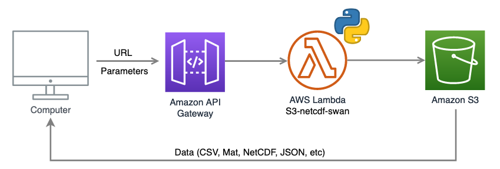
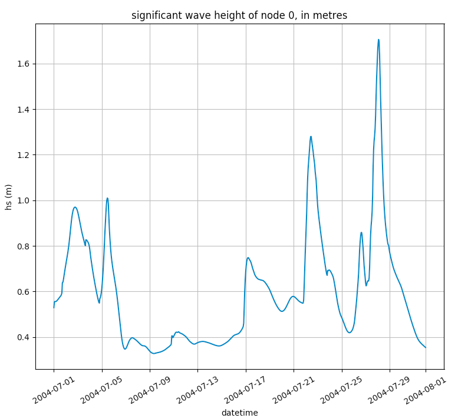
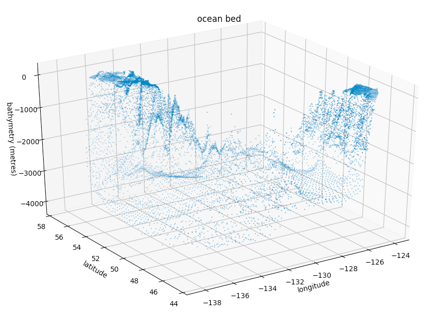
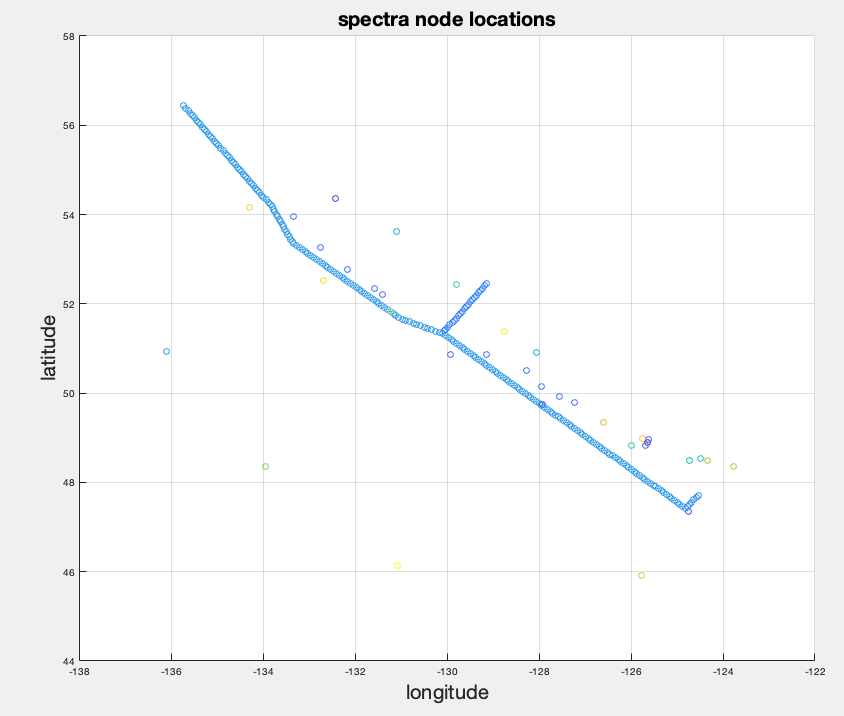
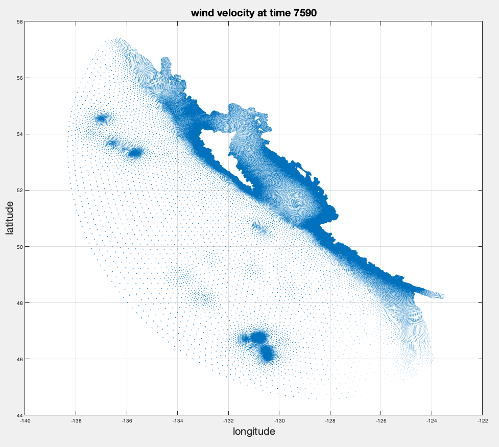
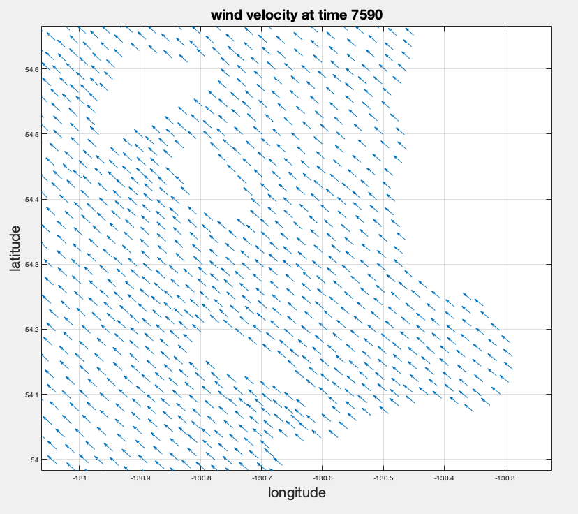
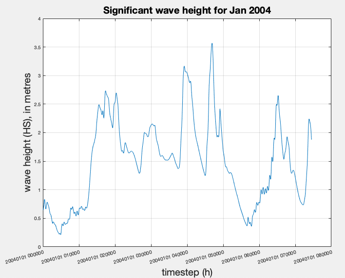

# URL queries with s3-netcdf-api

<!-- TOC depthFrom:2 -->

[Overview](#overview)

[Basic usage](#basic-usage)

- [query structure](#query-structure)

- [examples](#examples-and-outputs)

	- [using the browser](#using-the-browser)

	- [using python](#using-python)

	- [using matlab](#using-matlab)

[usage limits](#usage-limits)

[errors](#errors)

<!-- /TOC -->


## Overview

This user manual shows how to create URL queries that will download data from Amazon Web Service’s cloud storage (AWS S3). s3-netcdf-api is software that allows users to download spatial or temporal datasets (stored on S3 as “partitioned” NetCDF fies) back from the cloud. Examples given will demonstrate how to format various URL queries, as well as some MATLAB and Python scripts to extract and plot the datasets. The example dataset used in this document is a wave hind-cast data from the west coast of BC (BCSWANv5).



Downloading data involves creating a structured URL and using it in either a script that is run or directly in a web browser search bar. A python script runs in AWS Lambda as an intermediate step, but this is done behind the scenes with the end result returned to the user either as a saved file or displayed on the browser page.

## Basic Usage
### query structure

To download BCSWANv5 data, no credentials, access keys or passwords are necessary and no installation of any software is required. All data is accessed with a URL string, which contains the query parameters needed to download the corresponding data. The URL can be put in the search bar of a web browser, or used in a script that will download the data when the script runs.

The URL has two parts. The first half of the URL is the S3 address (AWS S3 bucket location), and the other half is the query (after the question mark):

S3 address:  ```https://api.meracan.ca/?```

example query:  ```variable=hs&inode=0:6&itime=2&export=csv```

The query is where parameters, variable names, indices, and export format are specified. An empty query (or putting gibberish after the question mark) will return a json object containing information about the swan data. This ‘default’ dump of meta data can be used as a reference for querying the data, and includes things like variable and parameter names, dimensions for them, maximum and minimum start and end times, et cetera:

```https://api.meracan.ca/?variable=hs&inode=0:6&itime=2&export=csv```

In the example query above, there are four parameters separated by ‘&’ symbols.

```variable``` is a required parameter. The ```group``` can also be specified but it is not necessary, as long as at least one variable is given--the variable in the query automatically selects the group and downloads the corresponding partition files.

The format is specified with ```export```. If ```export``` is not specified in the query, the default export format is json:

**```export=```**

```json```	javascript object notation (default)

```geojson```	geojson

```csv```	comma-separated values

```bin```	binary

```nc```	netcdf

```mat```	matlab

```tri```	tri

```slf```	selafin

```shp```	shapefile

For the coordinates, the inode and itime (node index and time index) can be specified, and both work the same way. A range of indices can be specified using a colon. Or, a list of particular nodes, not necessarily in order, using square brackets ```[]```:

**```inode=```** or **```itime=```**

```999```	index 999

```0:5```	first 5 indices (0, 1, 2, 3, and 4)

```3000:```	all indices starting from 3000

```:17```	indices 0 to 16

```[20, 26, 25]```	indices 20, 25, and 26

At least one of either node or time must be specified. Otherwise, the query will try to download too much data and the API will return an error. (see Errors section below)

Instead of node indices, latitude and longitude coordinates may be specified. Longitude can be given as either ```x```, ```lon```, or ```latitude```, and latitude as any of ```y```, ```lat```, or ```latitude```:

```x=-130&y=53```	53°N (latitude), -130°E (longitude) 

```x=-130.05&y=53.6```	53.6°N, -130.05°E

```x=-129,-130&y=53,53```	(53°N, -129°E) and (53°N, -130°E)

```lon=-130&lat=53```	53°N, -130°E

```longitude=-130&latitude=53```	53°N, -130°E

If the exact coordinates are not part of the dataset, it will interpolate and find the closest one (the more precise the better). Multiple nodes can be specified, as long as the number of longitudes and latitudes are balanced. Note that in the BCSWANv5 dataset the longitude is always negative.

Instead of time indices, a start and end time may be given. Both the start and end time are required if this format is used. The time format is Year, month, day, and then the hour separated by the letter T (```YYYY-MM-DDTHH:MM:SS```):
 
**```start=```**  and  **```end=```**

```2011-02-28T13:00:00```	28th of February at 1 pm

```2010-01-28T09```	28th of January at 9 am

```2010-01-28```	28th of January at 12 am

```2010-01-28T2```	28th of January at 2 am

Depending on the temporal resolution, the minutes and seconds may also be specified. The time step is per hour in the BCSWANv5 dataset.


## examples and outputs
### using the browser

```variable=elem&ielem=348361:``` last 3 polygon elements in the mesh:

```json
{
  "n1": {
    "0": 4213, "1": 177920, "2": 4214
  },
  "n2": {
    "0": 177919, "1": 177921, "2": 4453
  },
  "n3": {
    "0": 177921, "1": 177919, "2": 177920
  }
}
```

---
```variable=lon,lat&inode=9:12``` 
longitude and latitude for nodes 9, 10 and 11. 
The labels 0 1 and 2 have nothing to do with the node index, it’s just how the json object is created:
```json
{
  "longitude,degrees_east": {
    "0": -137.709844,
    "1": -137.7955865,
    "2": -137.8650661
  },
  "latitude,degrees_north": {
    "0": 55.96941419,
    "1": 55.80264507,
    "2": 55.63366653
  }
}
```

---
```variable=u10,v10&start=2008-07-01T12&end=2008-07-01T14&x=-125.907&y=49.153``` 
Wind velocity in Tofino on 1 July 2008 for 3 hours starting at lunch time:

```json
{ "Datetime": {
		"0": "2008-07-01T12:00:00",
		"1":"2008-07-01T13:00:00",
		"2":"2008-07-01T14:00:00"
  },
  "longitude,degrees_east": {
		"0":-125.907,
		"1":-125.907,
		"2":-125.907
  },
  "latitude,degrees_north": {
		"0":49.153,
		"1":49.153,
		"2":49.153
  },
  "u10,m\/s": {
		"0":-0.8487114906,
		"1":-0.684984982,
		"2":-0.5105854273
  },
  "v10,m\/s": {
		"0":1.3232467175,
		"1":1.3830788136,
		"2":1.4261398315
  }
}

```

---
```variable=u10,v10&start=2008-07-01T12&end=2008-07-01T14&x=-125.907&y=49.153&export=geojson```
with ```export=geojson``` :

```json
{ "type": "FeatureCollection",
  "features": [
  { "type": "Feature",
    "properties": {
      "Datetime": "2008-07-01T12:00:00",
      "longitude,degrees_east": -125.907,
      "latitude,degrees_north": 49.153,
      "u10,m/s": -0.8487114906,
      "v10,m/s": 1.3232467175
    },
    "geometry": {
      "type": "Point",
      "coordinates": [ -125.907, 49.153 ]
    }
  },
  { "type": "Feature",
    "properties": {
      "Datetime": "2008-07-01T13:00:00",
      "longitude,degrees_east": -125.907,
      "latitude,degrees_north": 49.153,
      "u10,m/s": -0.684984982,
```
...

---
```variable=u10,v10&start=2008-07-01T12&end=2008-07-01T14&x=-125.907&y=49.153&export=csv```
with  ```export=csv``` :

```json
Datetime,"longitude,degrees_east","latitude,degrees_north","u10,m/s","v10,m/s"
2008-07-01T12:00:00,-125.907,49.153,-0.8487115,1.3232467
2008-07-01T13:00:00,-125.907,49.153,-0.684985,1.3830788
2008-07-01T14:00:00,-125.907,49.153,-0.5105854,1.4261398
```

---
```variable=spectra&itime=1220&station=beverly&export=csv```
Spectra data at station beverly (Amphitrite buoy) at time index 1220:

```json
"longitude,degrees_east","latitude,degrees_north",Station Id,Name,Datetime,"absolute frequency,Hz","spectral nautical directions,degrees","spectra,m2/Hz/degr"
-125.633949,48.883999,0,beverly,2004-02-20T20:00:00,0.0345,265.0,1.3319053e-05
-125.633949,48.883999,0,beverly,2004-02-20T20:00:00,0.0345,255.0,1.3319053e-05
-125.633949,48.883999,0,beverly,2004-02-20T20:00:00,0.0345,245.0,1.3319053e-05
-125.633949,48.883999,0,beverly,2004-02-20T20:00:00,0.0345,235.0,1.3319053e-05
-125.633949,48.883999,0,beverly,2004-02-20T20:00:00,0.0345,225.0,1.3319053e-05
-125.633949,48.883999,0,beverly,2004-02-20T20:00:00,0.0345,215.0,1.3319053e-05
-125.633949,48.883999,0,beverly,2004-02-20T20:00:00,0.0345,205.0,1.3319053e-05
-125.633949,48.883999,0,beverly,2004-02-20T20:00:00,0.0345,195.0,0.0
-125.633949,48.883999,0,beverly,2004-02-20T20:00:00,0.0345,185.0,0.0
-125.633949,48.883999,0,beverly,2004-02-20T20:00:00,0.0345,175.0,0.0
-125.633949,48.883999,0,beverly,2004-02-20T20:00:00,0.0345,165.0,0.0
…
```
For spectra data, frequencies and direction dimensions don’t have to be specified.

---
```variable=name``` Station names for spectra data:
```json
{ "Name": {
    "0": "beverly", "1": "brooks", "2": "c_dixon", 
    "3": "c_eliz", "4": "campbell", "5": "e_dell", 
    "6": "hotspots", "7": "line_n", "8": "line_s", 
    "9": "line_w", "10": "m_nomad", "11": "n_hecat", 
    "12": "ne_isle", "13": "neah", "14": "p_renf", 
    "15": "perouse", "16": "s_hecat", "17": "s_morsb", 
    "18": "s_nomad", "19": "sombrio", "20": "sooke", 
    "21": "tarbotn", "22": "tillamk", "23": "tofino", 
    "24": "w_dixon",  "25": "w_morsb", "26": "w_otter", 
    "27": "w_washn"
  }
}
```

---
```variable=stationid``` Station ids for spectra nodes:
```json
{ "Station Id": {
     "0": 0, "1": 1, "2": 2, "3": 3,
     "4": 4, "5": 5, "6": 6, "7": 6,
     "8": 6, "9": 6, "10": 6, "11": 6,
     "12": 6, "13": 6, "14": 6, "15": 6,
     "16": 6, "17": 7, "18": 7, "19": 7,
```
...
```json
     "256": 23, "257": 24, "258": 25, 
     "259": 26, "260": 27
   }
}
```

---
The name of the buoy station can be determined with ```variable=name```, and the corresponding station can be determined for each of the 261 spectra nodes using ```variable=stationid```. For example, spectra nodes 6 through 16 show they are all part of station 6, which has the name “hotspots”. These two queries would therefore produce the same results:

```variable=spectra&isnode=6:17&itime=1220```

```variable=spectra&station=hotspots&itime=1220```

While the spatial node indices are specified with ```inode```, the spectra node indices are specified with ```isnode``` instead.


### using python

This example downloads the wave height for a single node over a month (July):
```python
import pandas as pd
import matplotlib.pyplot as plt
from urllib.parse import urlencode, unquote

pd.plotting.register_matplotlib_converters() # avoids warning

address = "https://api.meracan.ca/?"
query = urlencode({
  "export":"csv", 
  "variable":"hs", 
  "inode":"0", 
  "start":"2004-07-01", 
  "end":"2004-08-01"
})

df = pd.read_csv(address+query)
t = df["Datetime"].astype("datetime64[ns]")
y = df["hs,m"]

plt.plot(t,y)
plt.title(f"significant wave height of node 0, in metres")
plt.xlabel("datetime")
plt.ylabel(f"hs (m)")
plt.grid(True)
plt.xticks(rotation=30)
plt.show()
```

URL:
https://api.meracan.ca/?variable=hs&inode=0&start=2004-07-01&end=2004-08-01&export=csv

The ```urllib``` library helps encode a URL string. The ```pandas``` package is used to read from the given URL input and download the data (a “dataframe”, or ```df```, in pandas) into a csv file or table. Once the data is downloaded, a plot can be generated with ```matplotlib```’s  ```pyplot``` submodule.  ```plt.plot(t,y)``` creates a plot of the wave-height ```y``` as a function of time ```t```, taken from the two columns “hs,m” and “Datetime” from the csv table, respectively. The rest of the script is just labelling and formatting.

Result:



---
This example uses a 3D plot toolkit to plot the coordinate data for the first 10000 nodes (the longitude, latitude, and bathymetry):
```python
import pandas as pd    
import matplotlib.pyplot as plt
from mpl_toolkits import mplot3d
from urllib.parse import urlencode, unquote

pd.plotting.register_matplotlib_converters()

address = "https://api.meracan.ca/?"
query = urlencode({
  "export":"csv", 
  "variable":"lon,lat,bed", 
  "inode":":10000"
})
df = pd.read_csv(address+query)
lons = df["longitude,degrees_east"]
lats = df["latitude,degrees_north"]
bed = df["Bathymetry,m"]

ax = plt.axes(projection='3d')
plt.title("ocean bed")
ax.set_xlabel('longitude')
ax.set_ylabel('latitude')
ax.set_zlabel('bathymetry (metres)')
ax.scatter(lons,lats,bed, marker=".", s=1)
plt.grid(True)
plt.show()  
```

URL:
https://api.meracan.ca/?variable=lon,lat,bed&inode=:10000&export=csv

The result creates a scatterplot:



### using MATLAB

The spectra node (‘snodes’) locations can be plotted with the following example. A scatter plot uses the stationid to determine colour:
```matlab
url = 'https://api.meracan.ca/';
sdata = 'slon,slat,stationid';
 
data = webread(url, 'variable', sdata);
 
sx = cell2mat(struct2cell(data.longitude_degrees_east));
sy = cell2mat(struct2cell(data.latitude_degrees_north));
sc = cell2mat(struct2cell(data.StationId));
 
scatter(sx,sy,[],sc);
title('spectra node locations', 'FontSize', 20);
xlabel('longitude', 'FontSize', 20);
ylabel('latitude', 'FontSize', 20);
grid on;
```

URL:
https://api.meracan.ca/?variable=slon,slat,stationid

Result:



---
A quiver plot can be created with the longitude and latitude coordinates and the x and y components of the wind velocity, u10 and v10. This example shows the wind velocity for the first 50000 nodes:
```matlab
url = 'https://api.meracan.ca/';
vars = 'u10,v10';
itime = '7590';
inode = ':50000';
 
options = weboptions;
options.Timeout = Inf;
data = webread(url, 'variable', vars, 'itime', itime, options);
 
x = cell2mat(struct2cell(data.longitude_degrees_east));
y = cell2mat(struct2cell(data.latitude_degrees_north));
u = cell2mat(struct2cell(data.u10_m_s));
v = cell2mat(struct2cell(data.v10_m_s));
 
quiver(x,y,u,v);
 
title('wind velocity at time 7590', 'FontSize', 20);
xlabel('longitude', 'FontSize', 20);
ylabel('latitude', 'FontSize', 20);
grid on;
```
URL:
https://api.meracan.ca/?variable=u10,v10&itime=7590&inode=:50000

Result:





---
This example plots the significant wave height from the first node (index 0) in the dataset for a month:
```matlab
url = 'https://api.meracan.ca/?';
var = 'hs';
x = -136.7264224;
y = 57.39504017;
s = '2004-01-01';
e = '2004-02-01';
 
data = webread(url, 'variable',var, 'x',x, 'y',y, 'start',s, 'end',e);
 
times = cell2mat(struct2cell(data.Datetime));
hs = cell2mat(struct2cell(data.hs_m));
 
plot(hs);
title('Significant wave height', 'FontSize', 20);
xtickangle(15);
xticklabels(times);
xlabel('timestep (h)', 'FontSize', 20);
ylabel('wave height (HS), in metres', 'FontSize', 20);
grid on;
```
URL:
https://api.meracan.ca/?variable=hs&x=-136.7264224&y=57.39504017&start=2004-01-01&end=2004-02-01

The example below shows the same data as above, but loads and plots the data directly from the corresponding SWAN file itself rather than using a URL to download from the cloud:
```matlab
node = 1;
ntimes = 745;
HS = load('~/Desktop/results/2004/01/results/HS.mat');
fn = fieldnames(HS);
 
fns = string(fn);
fns = extractAfter(fns, 'Hsig_');
fns = strrep(fns, "_", " ");
hs = zeros(1, ntimes);
for i = 1:ntimes
 hs(i) = HS.(fn{i})(node);
end
plot(hs)
title('Significant wave height for Jan 2004', 'FontSize', 20);
xtickangle(15);
xticklabels(fns);
xlabel('timestep (h)', 'FontSize', 20);
ylabel('wave height (HS), in metres', 'FontSize', 20);
grid on;
```

Result:



## Usage Limits

There is a limit to how much data can be accessed, depending on the number of files being accessed in Lambda. Most of the time taken in downloading is spent preparing the data on AWS Lambda.

| query | size (MB) | prep time (s) | total time (s) |  
|---|---|---|---|
|```variable=u10&inode=0&export=csv```|0.985|	8.54|	9.05|
|```variable=u10&itime=0&export=csv```|	2.52|	13.24|	14.02|
|```variable=u10&inode=:210&itime=:210&export=csv```|	0.339|	3.70|	4.03|
|```variable=elem```|	3.9|	9.65|	10.7|
|```variable=u10,v10,hs,qp&inode=0```|	5.31|	12.28|	13.30|
|```variable=u10,v10,hs,qp&inode=:2```|	10.68|	24.67|	26.34|


## Errors

A timeout error may happen when accessing the data from AWS, from using the web browser or through a python or MATLAB script:

```sh
urllib.error.HTTPError: HTTP Error 500: Internal Server Error
```

If that happens and it is not trying to download too much data, this can usually be fixed by retrying or running the script again.

